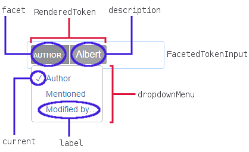

# Usage

You can use *react-faceted-token-input* to implement a tokenized input with
faceted behavior inside your React app.

## Demo

Head [here](example.md) to see a working example.

## Basic usage

```javascript
  import FacetedTokenInput from '../src/FacetedTokenInput';

  class App extends Component {

    constructor(props) {
      super(props);

      this.state = {
        dropdownSections: []
      };
    }

    renderToken(token) {
      return {
        facet: token.field,
        description: token.name,
        dropdownMenu: token.dropdownOptions
      };
    }

    onChange({ tokens, searchText }) {
      const requestId = Date.now();

      this.requestId = requestId;

      TokenTypes.getTokenSuggestions(searchText).then(dropdownSections => {
        if (this.requestId === requestId) {
          this.setState({ dropdownSections });
        }
      });
    }

    render() {
      return (
        <FacetedTokenInput
          renderToken={ this.renderToken }
          dropdownSections={ this.state.dropdownSections }
          placeholder="Search…"
          defaultTokens={ [] }
          onChange={ event => this.onChange(event) }
        />
      );
    }
  }
```

## Token

A `token` can be anything you need to be displayed, a single string, an object
or anything else.
It's a generic type that you define based on the implementation
of this component in your React app.

## Props

* [renderToken](#renderToken)
* [defaultTokens](#defaultToken)
* [placeholder](#placeholder)
* [dropdownSections](#dropdownSections)
* [onChange](#onChange)
* [children](#children)
* [dir](#dir)
* [componentClasses](#componentclasses)

<a name="renderToken"></a>
### renderToken(token) (Required)

A function that given a `token` returns a rendered token to use in the main
component.

```javascript
  renderToken(token) {
    return {
      facet: string?,
      description: string?,
      dropdownMenu: [
        {
          label: string?,
          current: boolean?,
          result: token
        },

        {
          label: string?,
          current: boolean?,
          result: token
        }
      ]
    };
  }
```

Here is a scheme of the `RenderedToken` properties, based on the example
included in the repository:



* `facet`: a string that should represent the *kind* of the token. You can omit
  it entirely.
* `description`: a string that should represent the *content* or *value* of the
  token.
* `dropdownMenu`: The other possible options (if available) for this token,
  defined as an array of objects. Each object contains:
  * `label`: a string that will be the label for this option,
  * `current`: a boolean that defines if this is the currently selected option
    so a small tick can be presented on the left side,
  * `result`: the new token that will overwrite the current one if this specific
    option is chosen by the user.

<a name="defaultToken"></a>
### defaultTokens

An array that contains the default displayed tokens.

```javascript
  defaultTokens = [];
```

<a name="placeholder"></a>
### placeholder

A string that will be displayed as a placeholder in the empty input.

```javascript
  placeholder = string?;
```

<a name="dropdownSections"></a>
### dropdownSections

An array that contains the possible dropdown options for auto completion.
It should start as an empty array inside the state in your constructor.

For example:

```javascript
  constructor(props) {
    super(props);

    this.state = {
      dropdownSections: []
    };
  }
```

<a name="onChange"></a>
### onChange

A function that dictate the behaviour of the input when you change the value,
displaying for example suggestions in the dropdown.

It could get:

`tokens`: the possible tokens that can be displayed

`searchText`: the input value to search in the suggestions

For example:

```javascript
  onChange({ tokens, searchText }) {
    // you can implement any method to get suggestions and
    // display the dropdown

    // from the example in this repository example
    const requestId = Date.now();

    this.requestId = requestId;

    TokenTypes.getTokenSuggestions(searchText).then(dropdownSections => {
      if (this.requestId === requestId) {
        this.setState({ dropdownSections });
      }
    });
  }
```

<a name="onChange"></a>
### children

Optional childs of the component. This should be a react element that will be
placed after the input and before the dropdown selection.

<a name="dir"></a>
### dir

`dir` is an optional prop that can accept only one of 2 strings:

* `rtl`: used to set the text direction to "right-to-left" for the languages
  that write from the right to the left
* `ltr`: used to set the text direction to "left-to-right" for the languages
  that write from the left to the right

This prop will tell where the text needs to be inside the input.

If the prop is not defined, the component will manage it for you, here is a
little explanation:

**Note**:
  * Be warned that the automatic behaviour of the component might not be what
  you need

The first time the component is loaded its `dir` will be set as `auto`, people
with different languages will see the component differently based on their
language writing style. As an example an arab (with their language set to
arabic) will see the placeholder to the right of the input while an italian
(with their language set to italian) will see it on the left.

After that based on their first input the component will choose if the display
style needs to change, for example:

* First input:
      a

  `dir` will be set to `ltr`

* First input:
      בְ

  `dir` will be set to `rtl`

The direction detection will be repeated every time the input is completely
empty (so when there is no textual input and no tokens displayed).

Remember that if you set the prop, your choice will **not** be overwritten.

**NOTE**:
  * To fully support bidirectional text you need to remember to adapt your css,
  for more information abot this topic head to the
  [Bidirectional support in css](./bidi-css-support.md) page in this documentation.

<a name="componentclasses"></a>
### componentClasses

Optional prop that let you stylize your component by adding classes to the
rendered HTML.

`componentClasses` should be an object containing as a key one of the available
selectors and as the value an array of strings or a single string containing the
classes that you want to add to the selector. Since *[classname](https://www.npmjs.com/package/classnames)*
is available to use the value can be anything that can be accepted by *classname*.
For Example:

```javascript
{
  'wrapper': 'class',
  'input': 'class1 class2',
  'token': ['class1 class2', 'myClass', {'otherClass': true}],
  'facet': [{'myClass': true, 'otherClass': false}]
}
```

The available selectors are:

* `wrapper`: the `div` that contains the component
* `input`: the `input` element of the component
* `tokenWrapper`: the `div` that contains all the tokens
* `token`: `span` element that represent the whole token
* `facet`: `span` element inside the `token` that represent the facet of the
  token
* `description`: `span` element inside the `token` that represent the desription
  of the token
* `dropdownWrap`: the `div` element that contains the dropdown menu in the facet
* `dropdownUl`: the `ul` list for the dropdown menu in the facet
* `dropdownLi`: the `li` elements of the dropdown list
* `dropdownA`: the `a` elements inside the `li` elements for the dropdown
* `suggestionsWrap`: the `div` containing the dropdown for the suggestions
* `suggestionsUl`: the `ul` list for a section of the suggestions dropdown
* `suggestionsLi`: the `li` elements of the suggestions dropdown list
* `sectionTitle`: the first `li` for the suggestions dropdown is a section title
* `suggestionsA`: the `a` elements inside the `li` elements for the suggestions
  dropdown

If you don't want to add this prop, some of the selectors already have classes
for you to use in your css:

* `wrapper`: `compound-input`
* `input`: `compound-input-field`
* `tokenWrapper`: `token-container`, `selected` (if is selected)
* `token`: `token`, `facet` (if the facet is shown)
* `facet`: `facet-type`
* `description`: `facet-value`
* `dropdownWrap`: `dropdown`, `token-dropdown`
* `dropdownLi`: `active` (if is selected)
* `suggestionsWrap`: `dropdown`, `input-dropdown`
* `suggestionsLi`: `active` (if is selected)
* `sectionTitle`: `header`

For ease of use we will write down an example of the rendered structure:

```xml
<wrapper>
  <tokenWrapper>
    <token>
      <facet>
        facet
      </facet>
      <description>
        description
      </description>
    </token>

    <token>
      <facet>
        facet
      </facet>
      <description>
        description
      </description>
    </token>

    <dropdownWrap>
      <dropdownUl>
        <dropdownLi>
          <dropdownA>
            anchor
          </dropdownA>
        </dropdownLi>

        <dropdownLi>
          <dropdownA>
            anchor
          </dropdownA>
        </dropdownLi>
      </dropdownUl>
    </dropdownWrap>
  </tokenWrapper>

  <input />

  <suggestionsWrap>
    <suggestionsUl>
      <sectionTitle>
        section title
      </sectionTitle>

      <suggestionsLi>
        <suggestionsA>
          anchor
        </suggestionsA>

        <suggestionsA>
          anchor
        </suggestionsA>
      </suggestionsLi>
    </suggestionsUl>

    <suggestionsUl>
      <sectionTitle>
        section title
      </sectionTitle>

      <suggestionsLi>
        <suggestionsA>
          anchor
        </suggestionsA>
      </suggestionsLi>
    </suggestionsUl>
  </suggestionsWrap>
</wrapper>
```
